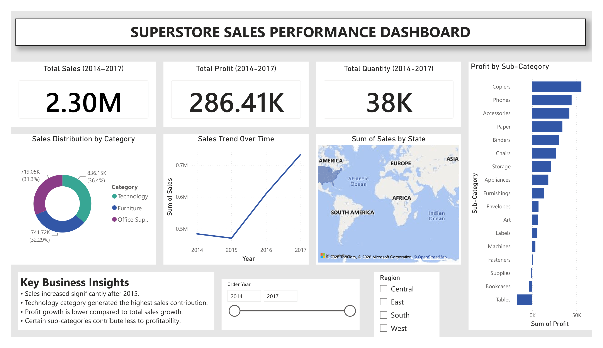

# Superstore Sales Performance Dashboard

An interactive Microsoft Power BI dashboard developed to analyze Superstore sales performance. The dashboard provides insights into sales, profit, product categories, regional performance, and yearly sales trends through interactive visualizations.

---

## Project Overview

The Superstore Sales Performance Dashboard transforms raw retail sales data into meaningful business insights using Microsoft Power BI. It helps users monitor key performance indicators (KPIs), identify profitable product categories, analyze sales trends, and evaluate regional performance for better decision-making.

---

## Problem Statement

Retail businesses generate large amounts of sales data every day. Without proper visualization and analysis, it becomes difficult to identify sales trends, profitable products, and business opportunities. This project provides an interactive dashboard to simplify sales analysis and support data-driven decisions.

---

## Objectives

- Analyze overall sales performance.
- Monitor total sales, profit, and quantity sold.
- Compare category-wise sales distribution.
- Identify profitable sub-categories.
- Analyze yearly sales trends.
- Evaluate state-wise sales performance.
- Support business decision-making using interactive dashboards.

---

## Technology Used

- Microsoft Power BI
- Power Query
- DAX

---

## Dataset

- **Dataset:** Superstore Sales Dataset
- **Source:** CSV File
- **Time Period:** 2014–2017

---

## Dashboard Preview



---

## Key Performance Indicators

| KPI | Value |
|------|-------:|
| Total Sales | 2.30M |
| Total Profit | 286.41K |
| Total Quantity | 38K |

---

## Dashboard Components

- KPI Cards
- Sales Distribution by Category
- Sales Trend Over Time
- Sales by State Map
- Profit by Sub-Category
- Year Filter
- Region Slicer
- Business Insights Panel

---

## Key Insights

- Sales increased significantly after 2015.
- Technology category generated the highest sales contribution.
- Copiers generated the highest profit among all sub-categories.
- Some product sub-categories require profitability improvement.
- Interactive filters allow dynamic business analysis by year and region.

---

## Repository Structure

```text
Superstore-Sales-Performance-Dashboard
│
├── Dashboard/
│   ├── Superstore_Sales_Performance_Dashboard.pbix
│   └── Dashboard_Image/
│       └── Dashboard.png
│
├── Data/
│   └── Superstore.csv
│
├── PPT/
│   └── Superstore_Sales_Performance_Dashboard.pptx
│
├── Report/
│   └── Superstore_Sales_Performance_Project_Report.pdf
│
├── README.md
└── LICENSE
```

---

## Author

**Tanishq**

Computer Science & Engineering Student

Aspiring Data Analyst

---

## License

This project is licensed under the MIT License.